# Carnet

**Un Notion maison, libre, où tes agents IA écrivent en Markdown.**

[](LICENSE)


[English version below](#english)

Carnet est un éditeur de pages en blocs (un arbre de pages, le menu `/`, des tableaux, des cases à cocher, des schémas, des graphiques) posé sur **un simple dossier de fichiers Markdown**. Pas de base de données, pas de compte, pas de cloud : tes notes restent des fichiers que tu peux lire, versionner et sauvegarder, et que tes agents IA lisent et écrivent directement. Quand un agent modifie la page que tu as ouverte, elle se met à jour sous tes yeux.

<p align="center">
  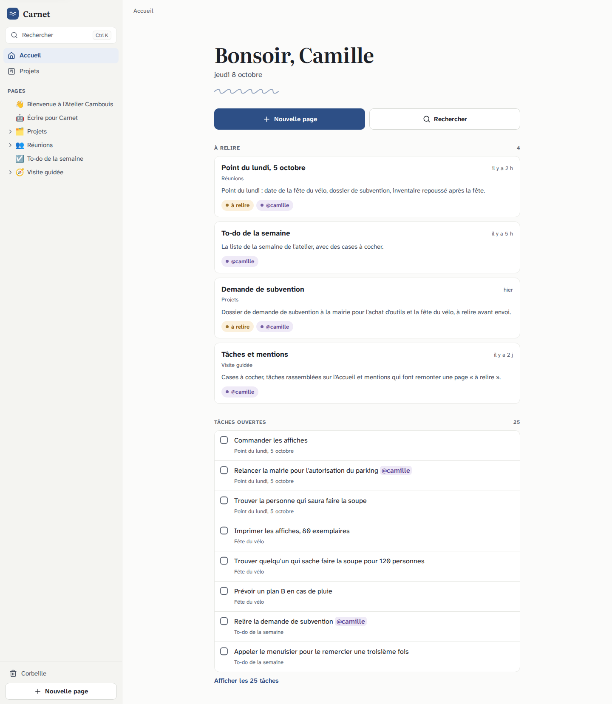
</p>

<p align="center">
  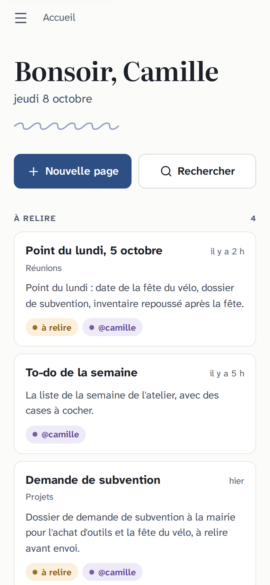
  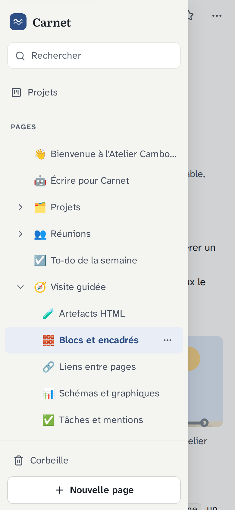
  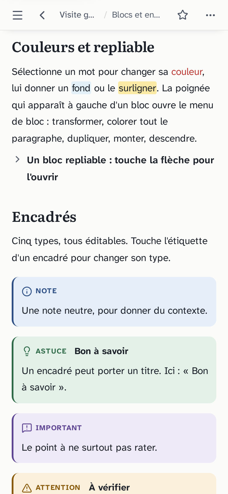
</p>

## Pourquoi

- **Tes agents écrivent déjà en Markdown.** Autant leur donner un endroit où l'écrire proprement, plutôt que de les brancher sur l'API d'un service tiers.
- **Tu veux une vraie interface**, agréable sur téléphone, pas un éditeur de texte brut : un arbre de pages, un menu `/`, des tableaux, des cases à cocher, des encadrés colorés.
- **Tu veux garder la main.** Des fichiers, git, aucun verrou. Si Carnet disparaît demain, tes notes sont toujours là, lisibles partout.
- **Tu veux de la sécurité sérieuse.** Un agent lit des mails et des pages web : un contenu piégé ne doit jamais pouvoir s'exécuter chez toi. Carnet isole tout ce qui est du code sur une autre origine.

## Ce que ça fait

- **Éditeur en blocs** (Tiptap 3, sans paquet payant). Le menu `/` en français : sous-page, lien vers une page, texte, titres, listes, tâche, citation, bloc repliable, séparateur, cinq encadrés, tableau, image, code, schéma, graphique, artefact, date du jour, sommaire. La poignée à gauche d'un bloc ouvre le **menu de bloc** : transformer en, couleur du texte et du fond, dupliquer, monter, descendre, supprimer, ou glisser le bloc ailleurs. Raccourcis à la Notion (`#`, `-`, `[]`, `>`, `+++`, ⌘D, ⌘⇧↑…), coloration du code (25 langages), liens `[[…]]`, enregistrement automatique.
- **Tes fichiers restent propres.** Une page ouverte sans modification n'est jamais réécrite ; quand tu modifies un bloc, seul ce bloc change dans le fichier. Les couleurs, le surlignage et le bloc repliable ont une écriture Markdown lisible ailleurs (`<span color="red">`, `==surligné==`, `<details>`).
- **Mise à jour en direct.** Un agent écrit, la page ouverte se met à jour en un peu plus d'un dixième de seconde. Si vous écrivez en même temps, un bandeau te laisse choisir quelle version garder.
- **Un arbre que tu ranges** : ordre manuel par glisser-déposer (rangé à part, dans `.carnet/ordre.json`, jamais dans tes pages), déplacer, dupliquer, icône et couverture de page, et sous le titre la liste des pages qui pointent vers celle-ci.
- **Corbeille** : supprimer envoie la page à la corbeille, avec « Annuler » pendant 8 secondes. Elle y reste 30 jours (réglable), avec aperçu et restauration à sa place.
- **Historique des versions** : les instantanés que tu prends, et les versions git si ton dossier est un dépôt git (lu en lecture seule). Comparaison mot à mot, restauration en un geste (Carnet garde d'abord un instantané de la version actuelle). Réglages dans [docs/deploiement.md](docs/deploiement.md).
- **Accueil utile** : toutes les tâches ouvertes de toutes les pages (cochables d'ici), une rubrique « À relire » (`statut: à relire` ou ta mention), les pages récentes.
- **Projets** : tableau et kanban construits sur le frontmatter (`statut`, `echeance`, `responsable`, `priorite`). Changer un statut, ou glisser une carte, réécrit **une seule ligne** du fichier.
- **Schémas et graphiques déclaratifs** : des blocs ` ```mermaid ` et ` ```vega-lite ` rendus dans un cadre isolé.
- **Artefacts HTML** : un agent livre un tableau de bord ou un simulateur, Carnet l'affiche dans une carte avec aperçu vivant et plein écran, sans qu'il puisse toucher à tes pages ni sortir sur Internet.
- **Recherche** (⌘K) dans les titres et les contenus, sans se soucier des accents, avec les pages consultées récemment, un aperçu, et « Créer la page » quand rien ne correspond. Renommer ou déplacer une page met à jour les liens des autres pages.
- **Pensé pour le téléphone d'abord** : tiroir d'arbre, barre au-dessus du clavier, cibles tactiles de 44 px, thèmes clair et sombre automatiques, installable sur l'écran d'accueil, écran clair quand la connexion manque (jamais de page blanche, jamais une note périmée).
- **Impression et PDF** : une feuille d'impression soignée (menu « … » de la page, puis « Imprimer ou exporter en PDF »).
- **Léger et rapide** : un serveur Node sans base de données. Le conteneur occupe environ 30 Mo de mémoire au repos ; une page s'ouvre en 75 ms depuis l'application et en 120 ms en rechargeant. Mesures détaillées dans [docs/architecture.md](docs/architecture.md#performances).

| Schémas et graphiques | Projets en kanban |
|---|---|
| <a href="docs/img/schemas-bureau.png">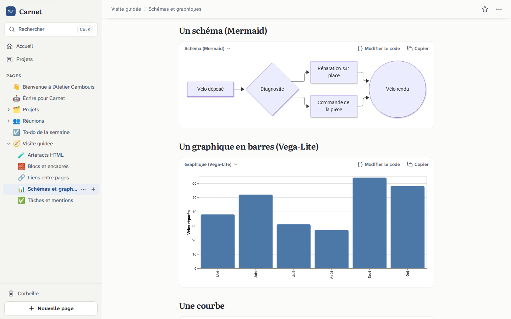</a> | <a href="docs/img/projets-kanban-bureau.png">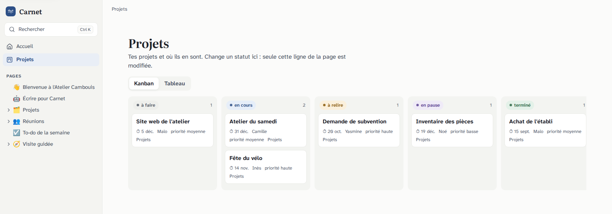</a> |
| **Le menu `/`** | **Le menu de bloc, la couverture et l'icône** |
| <a href="docs/img/menu-slash-bureau.png">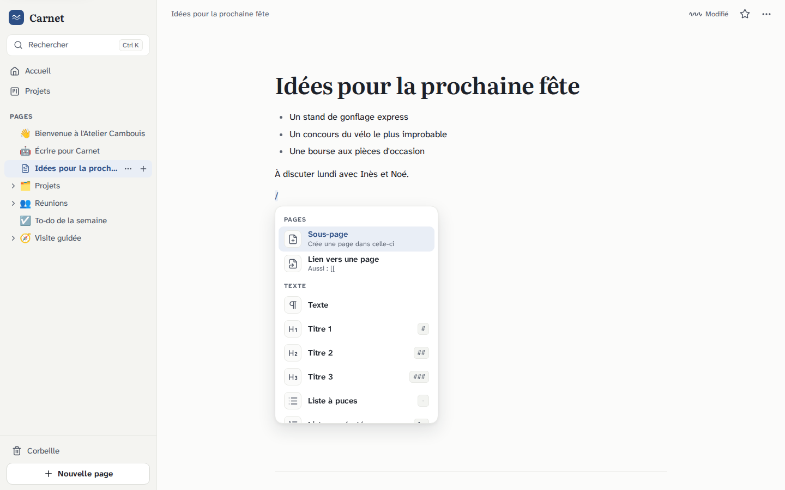</a> | <a href="docs/img/menu-bloc-bureau.png">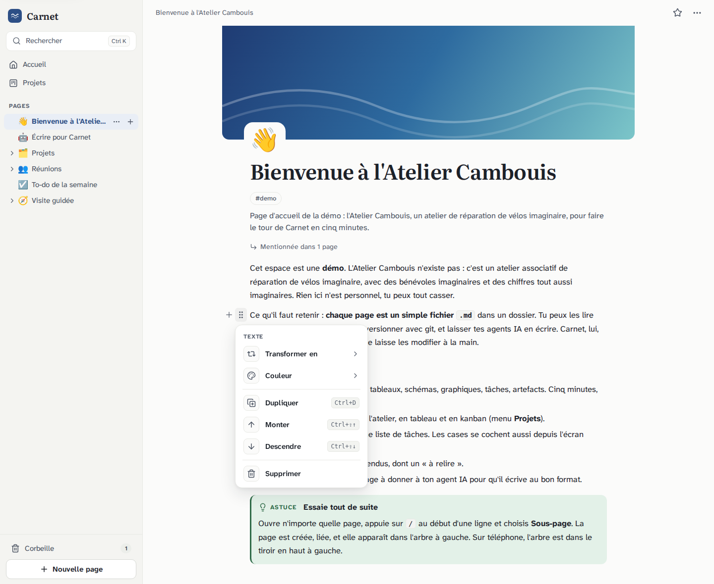</a> |
| **L'historique des versions** | **La corbeille** |
| <a href="docs/img/historique-bureau.png">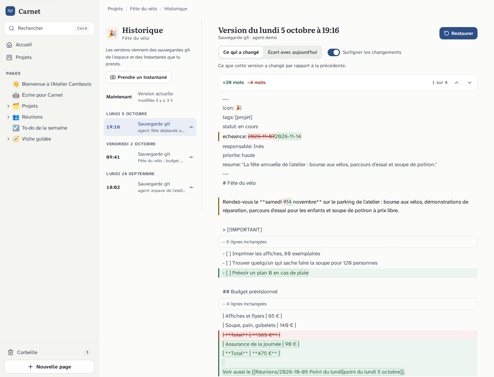</a> | <a href="docs/img/corbeille-bureau.png">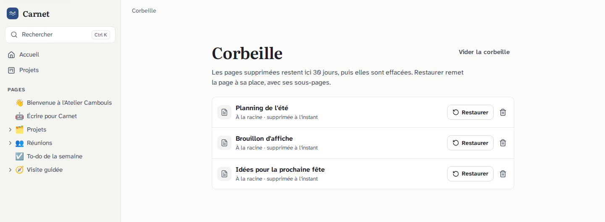</a> |
| **Un artefact HTML dans une page** | **Encadrés et tableau** |
| <a href="docs/img/artefact-bureau.png">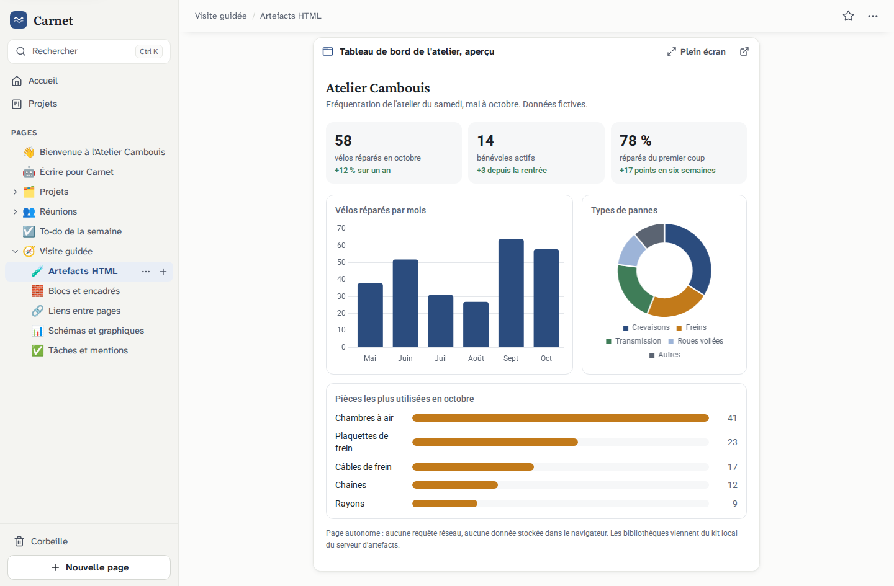</a> | <a href="docs/img/page-blocs-bureau.png">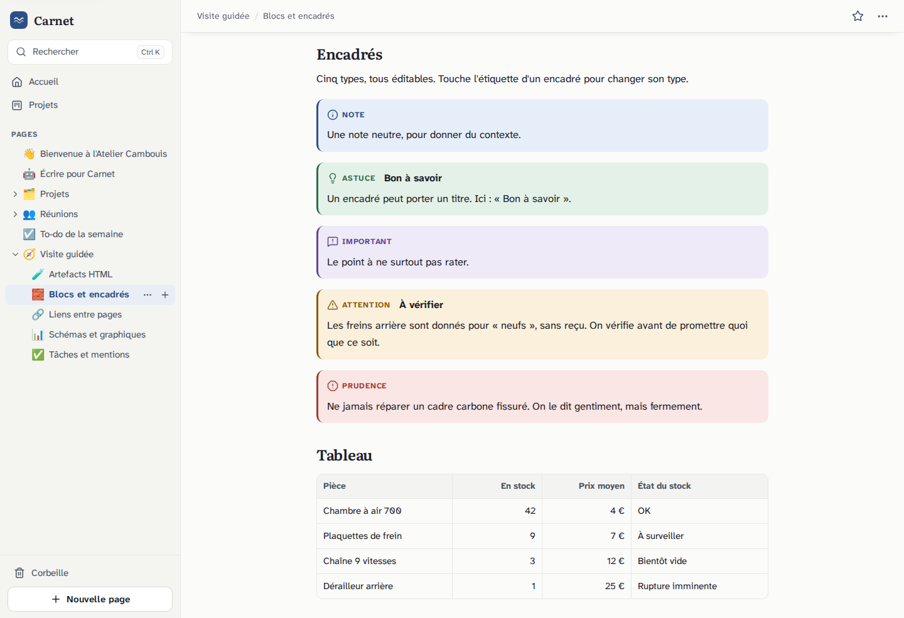</a> |

## Architecture

```
Navigateur ── proxy authentifiant (Tailscale Serve, Caddy + Authelia…) ──┬─▶ carnet     (Node 22)  127.0.0.1:3020
                                                                         │      pages .md, API, interface, flux SSE
                                                                         └─▶ artefacts  (Python)   127.0.0.1:3006  AUTRE origine
                                                                                artefacts HTML, schémas, graphiques, kit local
```

Deux petits conteneurs durcis. **La vérité, ce sont tes fichiers `.md`.** Carnet signe de courts liens HMAC qui ouvrent les artefacts sur l'autre origine ; les deux services ne se parlent pas. Le détail est dans [docs/architecture.md](docs/architecture.md).

## Démarrage rapide (Docker)

```bash
git clone https://github.com/MisterBD/carnet.git
cd carnet
./scripts/initialiser.sh          # crée .env, la clé de signature (chmod 600) et le dossier d'état
docker compose up -d --build
```

Ouvre <http://127.0.0.1:3020> : tu arrives dans l'espace de démonstration (`demo/`, un atelier de vélos imaginaire). Pour utiliser tes propres notes, mets `CARNET_ESPACE_HOTE=/chemin/vers/tes/notes` dans `.env` puis `docker compose up -d`.

L'essai local tourne en mode développement (`CARNET_DEV=1`), **sans authentification, sur 127.0.0.1 seulement**. Pour l'ouvrir à tes autres appareils, mets un proxy qui authentifie devant : Tailscale Serve est le plus simple. Tout est expliqué, avec des exemples de configuration (Tailscale Serve, Caddy + Authelia, Caddy + oauth2-proxy), dans [docs/deploiement.md](docs/deploiement.md).

## Faire écrire tes agents

Donne à ton agent le fichier [docs/format-agents.md](docs/format-agents.md) (ou la page `demo/Écrire pour Carnet.md`, qui en est la version courte), ou colle-lui la section « À coller dans le AGENTS.md ». En résumé : une page Markdown avec un frontmatter court, le niveau le plus bas qui suffit (texte, tableau, encadré, schéma, graphique, artefact HTML en dernier recours), une écriture atomique, et jamais de contenu extérieur recopié en HTML brut.

```md
---
title: Bilan du trimestre
icon: 📈
statut: à relire
tags: [rapport]
resume: "412 vélos réparés (+8 %), trois bénévoles font la moitié du travail."
---
# Bilan du trimestre

> [!WARNING] À vérifier
> Le chiffre de septembre n'a pas été confirmé.

- [ ] Confirmer septembre @camille
```

## Sécurité

Carnet affiche des pages écrites par des agents qui lisent des contenus non fiables. Son modèle de menace est détaillé dans [SECURITY.md](SECURITY.md). L'essentiel :

- **Rien d'exécutable sur l'origine de l'application** : le HTML brut d'une page est affiché comme du texte (seules quelques balises de mise en forme, en liste fermée, sont reconnues), aucun `.html`, `.svg`, `.js` ou `.css` n'est servi par l'application.
- **Les artefacts sont sur une autre origine**, dans un cadre `sandbox` à origine opaque, sans réseau (`connect-src 'none'`), ouverts par un lien signé de 15 minutes.
- **Pas de mot de passe** : l'identité vient d'un proxy authentifiant (Tailscale Serve, oauth2-proxy, Authelia…), avec une liste de comptes autorisés. **Ne l'expose jamais sans authentification.**
- CSP stricte, anti-CSRF, chemins confinés, historique git lu sans shell et en lecture seule, conteneurs en lecture seule sans privilèges, aucune ressource externe, dépendances et images épinglées.

Une faille ? Signale-la en privé (onglet *Security* du dépôt), voir [SECURITY.md](SECURITY.md).

## Feuille de route

Carnet sert tous les jours à son auteur. La recette de bout en bout (`tests/recette.py`, 28 étapes, qui vérifient aussi les fichiers sur le disque) tourne en Chromium et en WebKit (le moteur de Safari), sur iPhone émulé et sur ordinateur, en clair et en sombre. Ce qui manque encore, et qu'on aimerait ajouter (rien n'est promis, les contributions sont bienvenues) :

- **Tests publiés** : la suite d'isolation du serveur d'artefacts (requêtes HTTP piégées, navigateurs) et les recettes de l'éditeur et de la navigation, à rendre indépendantes de l'installation de l'auteur.
- **Éditeur** : colonnes, taille et alignement des images, visionneuse plein écran, réduction des photos avant l'envoi, mentions `@` avec suggestions, sélection de plusieurs blocs, recherche dans la page.
- **Navigation** : suivre l'ancre d'un lien `[[Page#Titre]]` jusqu'au titre, modèles de page, barre latérale redimensionnable, bandeau « cette page est dans la corbeille » sur l'adresse d'une page supprimée.
- **Sécurité** : un secret partagé entre le proxy et Carnet, en plus de l'en-tête d'identité.
- **iPhone réel** : le clavier, l'appui long et l'export PDF sont testés en émulation ; les retours sur appareil sont précieux.

Hors périmètre, volontairement : la collaboration en temps réel, une base de données, la gestion des mots de passe, l'exécution de code dans les pages. Voir [CONTRIBUTING.md](CONTRIBUTING.md).

## Contribuer, licence

Les contributions sont les bienvenues : [CONTRIBUTING.md](CONTRIBUTING.md) explique comment lancer les tests, ce qu'on attend d'une pull request, et la règle de licence (jamais de code GPL, AGPL ou propriétaire). Les licences des dépendances, des polices et des icônes sont dans [THIRD_PARTY_NOTICES.md](THIRD_PARTY_NOTICES.md).

Carnet est publié sous [licence MIT](LICENSE). Copyright (c) 2026 Dimitri Foucault.

---

<a id="english"></a>

# Carnet (English)

**A free, self-hosted "home-made Notion" where your AI agents write in Markdown.**

Carnet is a block-based page editor (page tree, `/` menu, tables, checkboxes, diagrams, charts) on top of **a plain folder of Markdown files**. No database, no account, no cloud: your notes stay files you can read, version with git and back up, and that your AI agents read and write directly. When an agent edits the page you have open, it updates live in front of you. The interface is in French; the format and the documentation of the writing rules are described below and in `docs/`.

> The project, its UI and most documentation are written in French. Issues and pull requests in English are welcome.

### Why

- Your agents already write Markdown. Give them a place to write it properly instead of wiring them to a third-party API.
- You want a real interface, pleasant on a phone, not a raw text editor.
- You want to stay in control: files and git, no lock-in. If Carnet disappears, your notes are still readable everywhere.
- You want serious security: an agent that reads emails and web pages must never be able to run injected code on your device. Carnet isolates everything that is code on a separate origin.

### Features

- Block editor built on Tiptap 3 (no paid packages): a French `/` menu, a block menu behind the drag handle (turn into, text and background color, duplicate, move up or down, delete, drag), Notion-style shortcuts, code highlighting (25 languages), `[[page links]]`, autosave.
- **Byte-faithful Markdown**: a page opened without changes is never rewritten, and when you edit a block only that block changes in the file. Colors, highlights and collapsible blocks use portable forms (`<span color="red">`, `==highlight==`, `<details>`).
- **Live updates** when an agent writes (a little over 0.1 s on the same machine), with a conflict banner if you both write at the same time.
- Page tree with manual drag-and-drop ordering (stored in `.carnet/ordre.json`, never in your pages), duplicate and move, page icons and covers, backlinks.
- **Trash** with an 8-second undo, 30-day retention (configurable), preview and restore.
- **Version history**: manual snapshots, plus git versions when your folder is a git repository (read-only). Word-level diff and one-click restore. Settings in `docs/deploiement.md`.
- Useful home screen (all open tasks across pages, "to review" list, recent pages), **Projects** table and kanban driven by frontmatter, accent-insensitive search with recent pages and preview.
- Declarative **Mermaid** diagrams and **Vega-Lite** charts rendered in an isolated frame.
- **HTML artifacts** delivered by agents (dashboards, simulators) shown in a sandboxed card: no network, no access to your pages.
- Mobile-first: tree drawer, bar above the keyboard, 44 px touch targets, automatic light and dark themes, installable (PWA), a clear offline screen, print and PDF export.
- Light: one Node server with a single dependency (`yaml`), no database, about 30 MB of RAM for the container at rest; a page opens in 75 ms from within the app.

### Architecture

Two small hardened containers: `carnet` (Node 22: pages, API, UI, SSE) and `artefacts` (Python standard library: sandboxed HTML artifacts, diagrams, a pinned local library kit) on a **different origin**. Short HMAC-signed links (15 minutes) open the artifacts; the two services never talk to each other. See [docs/architecture.md](docs/architecture.md) (French).

### Quick start (Docker)

```bash
git clone https://github.com/MisterBD/carnet.git
cd carnet
./scripts/initialiser.sh          # creates .env, the signing key (chmod 600) and the state folder
docker compose up -d --build
```

Open <http://127.0.0.1:3020>: you land in the demo space (`demo/`). To use your own notes, set `CARNET_ESPACE_HOTE=/path/to/your/notes` in `.env`, then `docker compose up -d`.

The local trial runs in development mode (`CARNET_DEV=1`): **no authentication, 127.0.0.1 only**. To reach it from your other devices, put an **authenticating proxy** in front (Tailscale Serve is the simplest). Examples for Tailscale Serve, Caddy + Authelia and Caddy + oauth2-proxy are in [docs/deploiement.md](docs/deploiement.md) (French).

### Security

Carnet has no passwords: identity comes from an authenticating proxy that sets an HTTP header, plus an allow-list of accounts. **Never expose it without authentication.** Page content never executes (raw HTML is shown as text; only a closed list of formatting tags is recognized), artifacts run in a sandboxed, network-less frame on another origin, git history is read without a shell, and everything is hardened (strict CSP, CSRF protection, confined paths, read-only containers, pinned dependencies). Threat model and how to report a vulnerability privately: [SECURITY.md](SECURITY.md).

### Roadmap

Not done yet, and welcome as contributions (nothing is promised): publishing the artifact-server isolation suite and the editor and navigation end-to-end suites, columns, image resizing and alignment, `@` mention suggestions, multi-block selection, in-page search, following `[[Page#Heading]]` anchors, page templates, a resizable sidebar, and a shared secret between the proxy and Carnet. Deliberately out of scope: real-time multi-user collaboration, a database, password management, code execution in pages.

### Contributing and license

See [CONTRIBUTING.md](CONTRIBUTING.md). Never copy GPL, AGPL, BSL or proprietary code. Third-party licenses are listed in [THIRD_PARTY_NOTICES.md](THIRD_PARTY_NOTICES.md).

Released under the [MIT license](LICENSE). Copyright (c) 2026 Dimitri Foucault.
