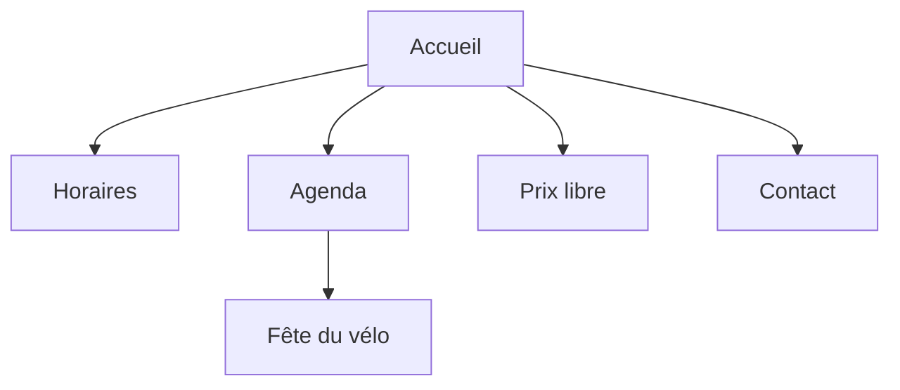

# Site web de l'atelier

Le site actuel date de l'époque où l'atelier avait un seul établi et une seule bénévole. Il est temps d'un coup de neuf.

## Ce qu'on veut

- Les horaires, lisibles en un coup d'œil sur téléphone
- L'agenda des ateliers du samedi, voir [[Projets/Atelier du samedi]]
- Un formulaire de contact (et un seul)
- Une page « Comment ça marche, le prix libre ? »

## Plan du site

> [!TIP]
> Un site statique suffit. Pas de base de données, pas de panneau d'administration, pas de maintenance. Les bénévoles ont mieux à faire.
