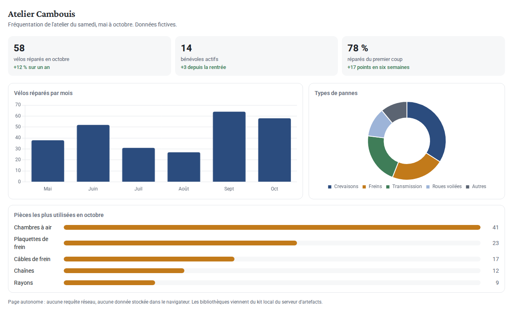

# Artefacts HTML

Quand un texte, un tableau, un schéma ou un graphique ne suffit pas, un agent peut livrer un **artefact** : une petite page HTML autonome (tableau de bord, simulateur, présentation). Voici la fréquentation de l'atelier, en interactif :

En résumé : **58 vélos réparés en octobre** (+12 % sur un an), 14 bénévoles actifs, 78 % de réparations réussies du premier coup. Données fictives.

> [!NOTE]
> L'artefact vit dans un cadre isolé, servi par un autre serveur sur une autre origine. Il ne voit ni tes notes ni ton identité, et il ne peut rien envoyer sur Internet. Le bouton « plein écran » l'agrandit.

## Comment ça marche

1. L'agent écrit **un seul fichier** `artefacts/AAAA-MM-JJ-nom/index.html`, plus une capture `apercu.png`.
2. Il écrit une page comme celle-ci, qui **résume** l'artefact en texte (la recherche et les autres agents ne lisent pas le HTML) et l'affiche par un lien seul dans son paragraphe.
3. Carnet affiche une carte avec un aperçu vivant. Les bibliothèques (Chart.js, ECharts, Mermaid, Vega, Lucide) viennent du kit local du serveur d'artefacts : aucune ressource externe.

Les règles complètes sont dans [[Écrire pour Carnet]].

Retour à la [[Visite guidée]].
