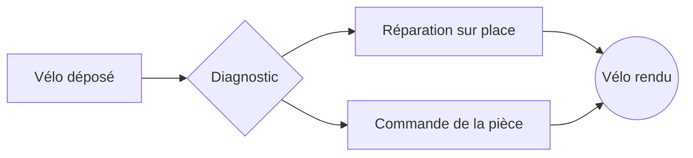

# Schémas et graphiques

Un schéma ou un graphique se décrit avec des **données**, pas avec du code exécutable. Carnet les affiche dans un cadre isolé, sur une autre origine que l'application. Un bouton bascule entre l'aperçu et la source.

## Un schéma (Mermaid)



## Un graphique en barres (Vega-Lite)

```vega-lite
{
  "description": "Vélos réparés par mois (données fictives)",
  "data": {"values": [
    {"mois": "Mai", "velos": 38}, {"mois": "Juin", "velos": 52},
    {"mois": "Juil", "velos": 31}, {"mois": "Août", "velos": 27},
    {"mois": "Sept", "velos": 64}, {"mois": "Oct", "velos": 58}
  ]},
  "mark": {"type": "bar", "cornerRadiusEnd": 4},
  "encoding": {
    "x": {"field": "mois", "type": "ordinal", "sort": null, "title": null},
    "y": {"field": "velos", "type": "quantitative", "title": "Vélos réparés"}
  }
}
```

## Une courbe

```vega-lite
{
  "description": "Part de réparations réussies du premier coup, en pourcentage (données fictives)",
  "data": {"values": [
    {"semaine": 1, "taux": 61}, {"semaine": 2, "taux": 64}, {"semaine": 3, "taux": 63},
    {"semaine": 4, "taux": 70}, {"semaine": 5, "taux": 74}, {"semaine": 6, "taux": 78}
  ]},
  "mark": {"type": "line", "point": true},
  "encoding": {
    "x": {"field": "semaine", "type": "ordinal", "title": "Semaine"},
    "y": {"field": "taux", "type": "quantitative", "title": "Réussite au premier coup (%)", "scale": {"domain": [50, 100]}}
  }
}
```

> [!NOTE]
> Pas d'expression ni de code dans le JSON Vega-Lite : des valeurs, des champs, des marques. Les données sont dans le bloc (`data.values`), jamais chargées depuis Internet.

Suite de la visite : [[Visite guidée/Tâches et mentions]].
