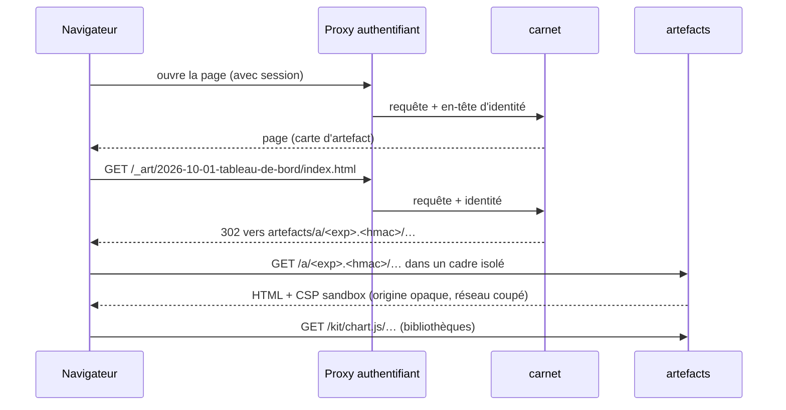

# Architecture

Carnet est un éditeur de pages en blocs, façon Notion, posé sur **un dossier de fichiers Markdown**. Ce document explique comment c'est construit et pourquoi, pour que tu puisses relire, auditer et contribuer.

## Principes

1. **La vérité, ce sont les fichiers `.md`.** Pas de base de données, pas de format intermédiaire. Un humain, un script, un agent IA ou git peuvent lire et écrire les mêmes fichiers. Carnet est une façade.
2. **Un humain et des agents écrivent au même endroit.** Quand un agent modifie la page ouverte, elle se met à jour sous les yeux de la personne. Quand la personne écrit, seul le bloc touché change dans le fichier.
3. **Les pages ne s'exécutent jamais.** Elles sont écrites par des agents qui lisent des contenus non fiables. Carnet n'interprète aucun HTML, ne sert aucun fichier actif depuis son origine, et isole tout ce qui est du code (artefacts, schémas, graphiques) sur une autre origine, sans réseau.
4. **Simple à héberger.** Deux petits conteneurs durcis (environ 30 Mo et 20 Mo de mémoire au repos), aucune base, aucun service externe, aucune ressource chargée depuis Internet.
5. **Une personne, ou un petit cercle de confiance.** Pas de collaboration en temps réel : deux écritures simultanées donnent un bandeau de conflit, pas une fusion.

## Vue d'ensemble

```
Navigateur (ordinateur, téléphone)
        │ HTTPS
        ▼
Proxy authentifiant : Tailscale Serve, ou reverse proxy + oauth2-proxy / Authelia…
(vérifie qui tu es, pose l'identité dans un en-tête HTTP)
        │                                         │
        ▼                                         ▼
carnet (Node 22)                          artefacts (Python, bibliothèque standard)
127.0.0.1:3020                            127.0.0.1:3006, AUTRE origine
 ├─ /          interface (build statique)   ├─ /a/<jeton>/…    artefacts HTML, jeton HMAC court
 ├─ /api/*     JSON, flux SSE               ├─ /rendu/mermaid  schémas, cadre isolé
 ├─ /_art/*    signe un lien, redirige ───▶ ├─ /rendu/vega-lite
 └─ dossier de pages .md (la vérité)        ├─ /kit/…          bibliothèques épinglées
                                            └─ /sante
```

Les deux services ne se parlent pas : ils sont sur des réseaux Docker distincts. Ils partagent seulement une **clé secrète** (lecture seule) qui sert à signer et vérifier les liens d'artefacts, et le dossier `artefacts/` de l'espace (lecture seule pour le serveur d'artefacts).

## Le serveur Carnet

Node 22, TypeScript exécuté directement (types retirés à la volée, aucune étape de compilation), `node:http` seul. **Une seule dépendance** : `yaml`.

| Module | Rôle |
|---|---|
| `main`, `app` | démarrage, arrêt propre, aiguillage des requêtes (`/sante`, `/api/*`, `/_art/*`, fichiers statiques) |
| `config` | lit les variables d'environnement une fois au démarrage, valide tout (voir [deploiement.md](deploiement.md)) |
| `securite` | identité, contrôle du `Host` (anti DNS-rebinding), anti-CSRF, confinement des chemins, en-têtes de sécurité, types de fichiers |
| `espace` | index en mémoire des pages, surveillance du disque (un `inotify` par dossier visible, rebalayage de sécurité toutes les 60 s), arbre trié, recherche |
| `api` | routes JSON : arbre, pages, recherche, accueil, projets, tâches, métadonnées, images, favoris, corbeille, historique, rangement |
| `corbeille` | `.corbeille/` de l'espace : mise à la corbeille, liste, aperçu, restauration à la même place, effacement, purge automatique |
| `historique` | versions d'une page lues dans git (lecture seule) et instantanés pris à la demande, rangés hors de l'espace |
| `ordre` | ordre manuel de l'arbre, dans `.carnet/ordre.json` (jamais dans les pages) |
| `liens` | rétroliens (« Mentionnée dans N pages ») et aperçu d'une page pour la recherche |
| `markdown` | extraction des liens et des tâches, détection des mentions, réécriture des liens après un renommage |
| `sse` | flux d'événements en direct (`modif`, `arbre`) |
| `art` | signature des liens d'artefacts (`/_art`), liste des artefacts |
| `disque` | écritures atomiques, lectures confinées |
| `statique` | sert le build de l'interface avec les bons en-têtes |
| `http` | réponses JSON, erreurs, journal (méthode, route, statut, durée, identité ; jamais de contenu) |

### Écritures

Une écriture est : fichier temporaire caché dans le dossier cible, `fsync`, mêmes permissions que l'original, `rename`, `fsync` du dossier. Une personne qui ouvre le fichier au même moment voit l'ancienne ou la nouvelle version, jamais un fichier à moitié écrit. Les agents sont invités à faire pareil (voir [format-agents.md](format-agents.md)).

Dans l'espace, Carnet n'écrit que des pages `.md`, les images envoyées (dans `_assets/`), le fichier de rangement `.carnet/ordre.json` et le contenu de `.corbeille/`. Les favoris et les instantanés vont dans le dossier d'état (`CARNET_ETAT`), hors de l'espace.

### Concurrence

Chaque page a un `ETag`. `PUT /api/page` exige `If-Match` : si le fichier a changé entre-temps, le serveur répond `412` avec le contenu actuel. L'interface affiche alors le bandeau « modifiée ailleurs » avec deux choix : recharger la version de l'autre, ou garder la sienne. La création utilise `If-None-Match: *`.

### Événements en direct

Le serveur surveille le dossier, regroupe les événements (120 ms) et les pousse en SSE. L'interface recharge la page ouverte si elle n'a pas de modification locale, sinon elle affiche le bandeau de conflit. Une écriture d'agent apparaît à l'écran en 0,13 s environ sur la même machine (voir « Performances »), plus le temps du réseau.

### API

Toutes les mutations exigent l'en-tête `X-Carnet: 1`.

| Domaine | Routes |
|---|---|
| Pages | `GET /api/config` · `GET /api/arbre` · `GET\|PUT /api/page?chemin=` · `POST /api/page` (nouvelle page ou sous-page) · `POST /api/renommer` · `POST /api/deplacer` · `POST /api/placer` (ranger avant, après ou dans une page) · `POST /api/dupliquer` · `POST /api/supprimer` (vers la corbeille) |
| Lecture | `GET /api/recherche?q=` · `GET /api/apercu?chemin=` · `GET /api/retroliens?chemin=` · `GET /api/accueil` · `GET /api/projets` · `GET /api/artefacts` · `GET /api/couvertures?page=` · `GET /api/fichier?chemin=` · `GET /api/evenements` (SSE) |
| Petites écritures | `POST /api/tache` (une case) · `POST /api/meta` (une ligne du frontmatter) · `POST /api/images?page=` · `GET\|PUT /api/favoris` |
| Corbeille | `GET /api/corbeille` · `GET /api/corbeille/apercu?id=` · `POST /api/corbeille/restaurer` · `POST /api/corbeille/effacer` (un élément, ou tout) |
| Historique | `GET /api/historique?chemin=` · `GET /api/version?chemin=&id=` · `POST /api/instantane` · `POST /api/restaurer-version` |
| Autres | `GET /_art/<chemin>` (lien signé vers le serveur d'artefacts) · `GET /sante` (sans identité) |

### Corbeille

Supprimer une page la déplace, avec ses sous-pages, dans `.corbeille/<AAAAMMJJ-HHMMSS-xxxx>/<chemin d'origine>`, à côté d'un `.meta.json` (chemin, titre, icône, date, nombre de sous-pages, identité). L'interface propose « Annuler » pendant 8 secondes, puis la page **Corbeille** liste les éléments avec un aperçu. Restaurer remet la page à sa place (dossiers parents recréés au besoin ; si le nom est pris, « X (restaurée) »). La meta est revalidée avant tout déplacement : un chemin piégé dans un `.meta.json` est refusé. Les éléments plus vieux que `CARNET_CORBEILLE_JOURS` (30 par défaut, 0 pour jamais) sont effacés au démarrage puis toutes les 24 heures. Les images de `_assets/` ne partent jamais avec une page.

### Historique des versions

Deux sources, réunies dans une seule liste :

- **git**, en lecture seule. Si le dossier de pages est dans un dépôt git (`CARNET_GIT=auto`), Carnet liste les commits qui touchent la page (`git log --follow`, renommages suivis, 200 au plus) et lit un contenu par `git cat-file blob`. Git est appelé par `execFile`, jamais par un shell, avec un environnement assaini (configuration système et globale ignorées, chemins littéraux, aucune invite), 5 secondes au plus et deux processus à la fois. Carnet ne fait jamais de commit : ce sont tes agents, tes scripts ou toi qui versionnent le dossier.
- **instantanés**, pris par le bouton « Prendre un instantané », ou automatiquement juste avant une restauration. Ce sont des copies complètes rangées dans `CARNET_ETAT/instantanes/<espace>/<chemin de la page>/`, hors de l'espace (droits 0700 et 0600, 100 au plus par page). Ils suivent la page quand elle est renommée ou déplacée.

L'écran compare deux versions mot à mot (algorithme de Myers, dans `shared/diff.ts`) : « Ce qui a changé » par rapport à la version précédente, ou « Écart avec aujourd'hui ». Restaurer écrit l'ancienne version de façon atomique, après un instantané de la version actuelle.

### Rangement de l'arbre

Dans un dossier, l'arbre trie d'abord les noms rangés à la main (glisser-déposer, ou Monter et Descendre au toucher), puis les autres pages par le champ `ordre:` du frontmatter, puis par titre. Le rangement manuel est écrit dans `.carnet/ordre.json` (`{"version": 1, "dossiers": {"": ["Accueil", "Projets"], "Projets": ["Fête du vélo"]}}`), jamais dans les fichiers `.md` : ranger l'arbre ne crée aucun bruit dans les pages des agents. Renommer, déplacer et dupliquer mettent ce fichier à jour.

## L'interface

Vite, React 19 et TypeScript. L'éditeur est **Tiptap 3** (sur ProseMirror), uniquement avec des paquets libres. La couche Markdown est faite maison sur `mdast` (micromark, GFM) : Tiptap ne lit ni n'écrit lui-même le Markdown. L'éditeur est chargé à part et préchargé au repos : l'interface s'affiche avant. Polices et icônes sont locales.

C'est une application installable (PWA). Son service worker ne met en cache que la **coquille** : polices, icônes, écran de repli et fichiers `/assets/*` à empreinte. Une navigation passe toujours par le réseau ; si le réseau manque, il sert l'écran « Pas de connexion au carnet » avec un bouton Réessayer, jamais une copie périmée. L'API, le flux en direct, les fichiers de l'espace et les artefacts ne passent jamais par lui. Il n'y a donc pas de lecture hors ligne des pages, et c'est voulu.

### Fidélité Markdown

C'est la propriété la plus importante : **Carnet ne reformate jamais un fichier que personne n'a modifié, et quand une personne modifie un bloc, seul ce bloc change dans le fichier.** Les agents écrivent des fichiers que git suit : un éditeur qui réécrit tout à chaque ouverture serait inutilisable.

1. **Pas de modification, pas d'écriture.** L'éditeur sérialise la page à l'ouverture (état de référence). Tant que la sérialisation courante est égale à cet état, rien n'est écrit, même si l'éditeur a normalisé des détails en interne.
2. **Le frontmatter et le titre ne passent jamais par l'éditeur.** `shared/page.ts` découpe chaque page en frontmatter brut, bloc titre (`# Titre` et ses lignes vides) et corps. Seul le corps va dans l'éditeur. Changer le statut, l'icône ou le titre modifie **une seule ligne** du YAML, jamais le bloc entier (listes en colonne 0, BOM et fins de ligne conservés).
3. **Fusion bloc par bloc.** À l'enregistrement, les blocs de premier niveau de la nouvelle sérialisation sont alignés sur ceux de l'état de référence (plus longue sous-suite commune). Un bloc inchangé est réécrit avec **son texte original, octet pour octet**, séparateurs compris. Si l'alignement n'est pas sûr, la nouvelle sérialisation est écrite telle quelle : correcte, juste plus bruyante.
4. **Sérialisation réglée** pour coller à l'écriture des agents : puces `-`, `**gras**`, `_italique_`, clôtures en accents graves, tableaux GFM, cases `- [ ]`. Les marqueurs d'origine (`*` ou `_`, `-` ou `*`, longueur de clôture, saut de ligne par `\` ou deux espaces…) sont mémorisés pour réécrire un bloc comme il était écrit.
5. **Une grammaire fermée pour les blocs maison.** Seules ces formes exactes sont reconnues, avec des attributs en liste blanche : liens `[[Page]]`, `[[Page|alias]]`, `[[Page#titre]]`, encadrés `> [!NOTE]` … `[!CAUTION]`, couleurs `<span color="red">` et `<span color="red_bg">` (neuf noms), surlignage `==…==` ou `<mark>`, souligné `<u>`, bloc repliable `<details>` / `<summary>`, sommaire `<!-- sommaire -->`, cartes d'artefact, images en bloc avec légende. **Tout autre HTML reste du texte brut**, affiché en gris, jamais interprété, et réécrit à l'octet.

Un banc (`web/outils/fidelite.html`, construit par `npx vite build --mode outils` et piloté par `tests/fidelite.py`) rejoue ces scénarios sur tout un dossier de pages : page ouverte sans modification, paragraphe ajouté, mot ajouté au début, case cochée, frontmatter modifié. Le critère est « seul le bloc touché diffère, le reste est identique à l'octet ».

### Hiérarchie des pages

La page `Projets.md` a pour sous-pages les fichiers du dossier `Projets/` : convention d'Obsidian. Un dossier sans page du même nom apparaît comme une page « dossier », créée à la première écriture. Renommer ou déplacer une page met à jour les liens `[[…]]` des autres pages (jamais ceux qui sont dans des blocs de code), ses favoris, son rangement et ses instantanés. Le titre se change dans la page : la ligne `# Titre` (ou `title:`) change, et le fichier n'est renommé que si son nom suivait le titre (une page nommée `2026-10-08-note.md` par un agent garde son nom). Supprimer envoie la page à la corbeille.

## Le serveur d'artefacts

Python 3, bibliothèque standard seulement. Il sert, sur une **origine séparée** de l'application :

- les **artefacts** HTML écrits par les agents (`artefacts/` de l'espace, monté en lecture seule) ;
- le **kit** de bibliothèques épinglées (Chart.js, ECharts, Mermaid, Vega, Vega-Lite, vega-embed, vega-interpreter, Lucide, polices) ;
- deux **pages de rendu** isolées pour les blocs ` ```mermaid ` et ` ```vega-lite `.

### Routes

| Route | Réponse |
|---|---|
| `GET /a/<exp>.<hmac>/<chemin>` | fichier de l'artefact. `403` jeton invalide ou chemin interdit, `410` jeton expiré, `404` introuvable, `413` au-delà de 5 Mio. Les chemins relatifs (`./style.css`) restent couverts par le même préfixe de jeton. Pas de listing. |
| `GET /kit/<bibliothèque>/<fichier>` | bibliothèque du kit (`Access-Control-Allow-Origin: *`, cache long si l'URL porte `?v=`) |
| `GET /rendu/mermaid`, `/rendu/vega-lite` | pages de rendu isolées, mêmes en-têtes que les artefacts |
| `GET /sante` | `200 ok`. Rien d'autre n'est servi. |

### Jeton

`exp` est l'instant Unix d'expiration (maintenant + 15 minutes par défaut). `hmac = base64url(HMAC-SHA256(clé, exp + "/" + portée))`, 43 caractères. La **portée** est le premier segment du chemin, c'est-à-dire le **dossier de l'artefact** : un jeton ne donne accès qu'à un seul artefact, et ses fichiers voisins (`./data.js`, `./logo.svg`) restent couverts. La comparaison est en temps constant et l'expiration n'est regardée qu'après validation de la signature. La clé (32 octets) est relue si le fichier change : une rotation sans redémarrage invalide tous les liens en cours.

Le serveur Carnet signe lui-même ses liens (`/_art/<chemin>` renvoie un `302` vers `<base des artefacts>/a/<jeton>/<chemin>`) avec la même clé et le même format ; un test compare son résultat à celui du serveur d'artefacts.

### Isolation

Chaque réponse d'artefact ou de rendu porte :

```
Content-Security-Policy: sandbox allow-scripts allow-downloads allow-modals; default-src 'none';
  script-src 'self' 'unsafe-inline' <base>/kit/; style-src 'self' 'unsafe-inline' <base>/kit/;
  img-src 'self' data: blob:; font-src <base>/kit/; connect-src 'none';
  frame-ancestors <origines des applications>; base-uri 'none'; form-action 'none'
X-Content-Type-Options: nosniff
Referrer-Policy: no-referrer
Cache-Control: private, no-store
```

Conséquences : l'artefact a une **origine opaque** (le `sandbox` sans `allow-same-origin`), donc pas de cookie, pas de `localStorage`, pas d'accès à l'application ; `connect-src 'none'` coupe `fetch`, `XMLHttpRequest` et `WebSocket` ; seules les bibliothèques du kit peuvent être chargées ; seule l'application peut l'embarquer dans un cadre. Dans l'application, le cadre est `sandbox="allow-scripts"` et les messages ne sont acceptés que de `event.source === iframe.contentWindow`.

### Pont `postMessage`

`/kit/pont.js` envoie la hauteur du contenu à l'hôte (`artefact:hauteur`) pour ajuster le cadre, et applique le thème de l'hôte (`hote:theme`) sur `<html data-theme>`. Il ne reconnaît l'hôte que par `e.source === window.parent`, jamais par l'origine (opaque, donc `null`).

### Chemins et fichiers

Refusés : `..`, segments cachés, `//`, antislash, caractères de contrôle, encodages invalides, plus de 16 niveaux. Un seul décodage d'URL. Liens symboliques refusés s'ils sortent du dossier de l'artefact, avec un contrôle avant et après ouverture (via `/proc/self/fd`) contre les courses entre contrôle et ouverture. Seuls les fichiers réguliers sont servis, 5 Mio au plus, types MIME par liste (extension inconnue : `application/octet-stream` en téléchargement forcé).

### Le kit

`artefacts/kit.lock.json` épingle, pour chaque bibliothèque, une version et l'empreinte `sha512` de son tarball. `artefacts/maj-kit.py` (bibliothèque standard) télécharge les tarballs sur le registre npm, vérifie l'empreinte contre le verrou **et** contre celle que publie le registre, extrait seulement les fichiers prévus, interroge l'API d'avis de sécurité de npm, et refuse de continuer si une version épinglée a un avis connu. Le kit est construit à la construction de l'image Docker. `./maj-kit.sh --etat` compare aux dernières versions, `--maj` les adopte dans des bornes déclarées.

## Parcours : ouvrir un artefact



## Identité et accès

Carnet ne gère **aucun mot de passe**. Il fait confiance à un en-tête HTTP posé par un proxy authentifiant placé devant lui (voir [deploiement.md](deploiement.md)) : chaque requête, sauf `/sante`, doit porter un login présent dans la liste `CARNET_UTILISATEURS_AUTORISES`, sinon `403`. Un `Host` inconnu donne `421`. Le port n'est publié que sur `127.0.0.1` et le conteneur est sur un réseau dédié, pour que personne ne puisse atteindre Carnet en forgeant l'en-tête.

## Disposition d'un espace

```
mon-espace/
├── Accueil.md                 une page (frontmatter + Markdown)
├── Projets.md                 page d'index…
├── Projets/                   …dont les sous-pages sont les fichiers de ce dossier
│   └── Fête du vélo.md
├── _assets/                   images de la page voisine (png, jpg, webp, gif ; avif affiché aussi)
├── artefacts/                 artefacts HTML : AAAA-MM-JJ-nom/index.html + apercu.png
├── .carnet/ordre.json         rangement manuel de l'arbre (jamais servi)
├── .corbeille/                pages supprimées, avec leur .meta.json (jamais servie comme page)
└── .git/                      facultatif : l'historique git que Carnet lit (jamais servi)
```

Jamais lus comme pages, listés ni servis : les segments cachés (commençant par `.`), le dossier `artefacts/` comme pages, et les dossiers de premier niveau listés dans `CARNET_MASQUES`. Les liens symboliques ne sont suivis que s'ils restent dans l'espace et ne sont jamais modifiés. Les images envoyées sont vérifiées par leurs octets magiques (10 Mo au plus).

## Performances

Mesuré le 8 octobre 2026 sur un VPS à 4 cœurs partagés, Chromium et serveur sur la même machine (donc sans le temps du réseau), avec l'espace de démonstration (19 pages), médiane de 9 essais. Le script de mesure n'est pas encore publié ; ces chiffres donnent un ordre de grandeur, pas une promesse.

| Mesure | Ordinateur | iPhone émulé, processeur ralenti 4 fois |
|---|---:|---:|
| Accueil affiché, à froid (aucun cache) | 172 ms | 558 ms |
| Accueil affiché, rechargé | 89 ms | 226 ms |
| Page riche prête (encadrés, tableau), à froid | 333 ms | 1 152 ms |
| Page riche prête, rechargée | 121 ms | 440 ms |
| Page riche prête, ouverte depuis l'application | 74 ms | 245 ms |

- **Écriture d'un agent** (renommage atomique d'un fichier) visible dans la page ouverte : 134 ms (de 132 à 140 ms).
- **API** : `/api/arbre` et `/api/recherche` répondent en moins d'une milliseconde sur la démo. Sur 1 000 pages synthétiques (4 Mo, 20 dossiers) : indexation au démarrage en 0,9 s, `/api/arbre` 0,9 ms, recherche 1,5 ms, accueil 1,3 ms (médianes).
- **Poids de l'interface** (gzip) : 108 Ko de JavaScript et 18 Ko de CSS pour s'afficher ; l'éditeur (244 Ko) est chargé à part, en arrière-plan.
- **Mémoire au repos** : le conteneur `carnet` (image Alpine, tas plafonné à 128 Mo) occupe 31 Mo sur l'instance de l'auteur, le serveur d'artefacts 12 à 23 Mo selon le cache des fichiers du kit. Hors conteneur (glibc, sans plafond de tas), le processus Node occupe 47 Mo au repos, 56 Mo après une session de travail, 57 Mo avec 1 000 pages indexées.

## Limites connues

- Pas de collaboration en temps réel : le dernier mot revient à la personne qui choisit, après le bandeau de conflit.
- Les en-têtes d'identité font foi : n'importe quel processus qui atteint `127.0.0.1:3020` peut les forger. Même niveau de confiance que n'importe quel service local ; ne pas partager la machine avec des tiers non fiables.
- Notes de bas de page, formules mathématiques, HTML hors de la grammaire fermée et syntaxes propres à d'autres outils s'affichent comme du texte brut.
- Un lien `[[Page#Titre]]` ouvre la page en haut : l'ancre est conservée dans le fichier mais pas encore suivie.
- Une cellule de tableau ne contient qu'un paragraphe (GFM n'a ni liste ni retour à la ligne dans une cellule). Pas de colonnes de mise en page.
- La couleur `<span color>` n'est pas rendue par GitHub ni par Obsidian : le texte s'y affiche normalement, rien n'est cassé.
- Les favoris et les instantanés vivent hors de l'espace (`CARNET_ETAT`), pas dans les fichiers ; l'ordre manuel vit dans `.carnet/ordre.json`.
- Pas de lecture hors ligne des pages (choix : jamais de note périmée à l'écran).
