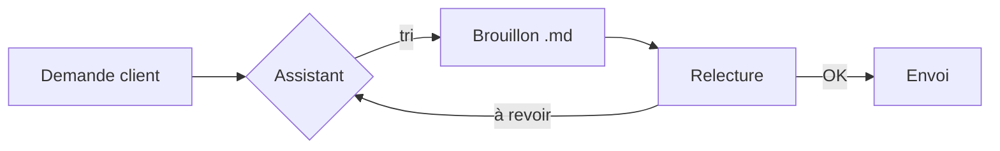
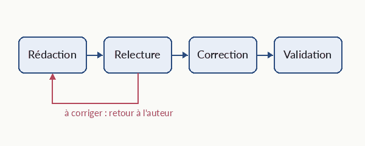

---
pageDecoration:
  icon: layers
statut: en cours
tags: [demo]
resume: "Page de démonstration : tous les blocs riches du format pivot."
updated: 2026-10-01
---
# Une page riche

Le Markdown reste la source de vérité. Les blocs ci-dessous s'affichent joliment ici, et restent lisibles dans n'importe quel éditeur.


## Alertes

> [!NOTE]
> Une note neutre, pour du contexte.

> [!TIP] Bon à savoir
> Une astuce : tape `/` en début de ligne pour insérer un bloc.

> [!IMPORTANT]
> Point clé à retenir avant la réunion de jeudi.

> [!WARNING] À vérifier
> Le fournisseur n'a pas encore confirmé la livraison de septembre.

> [!CAUTION]
> Ne pas envoyer ce document tel quel : il contient des chiffres provisoires.

## Tableau

| Service | Réparations T3 | Évolution | Statut |
|---|---:|---:|---|
| Révision | 120 | +12 % | 🟢 OK |
| Freins | 98 | -3 % | 🟠 À suivre |
| Crevaison | 64 | +4 % | 🟢 OK |
| Pneus | 41 | -18 % | 🔴 Alerte |

## Schéma



## Graphique

```vega-lite
{
  "$schema": "https://vega.github.io/schema/vega-lite/v6.json",
  "description": "Réparations par mois",
  "data": {"values": [
    {"mois": "Juil", "n": 120}, {"mois": "Août", "n": 132},
    {"mois": "Sept", "n": 160}, {"mois": "Oct", "n": 148}
  ]},
  "mark": {"type": "bar", "cornerRadiusEnd": 4},
  "encoding": {
    "x": {"field": "mois", "type": "ordinal", "sort": null, "title": null},
    "y": {"field": "n", "type": "quantitative", "title": "Réparations"}
  }
}
```

## Images

Un schéma exporté en image :



## Tâches

- [x] Récupérer les chiffres T3
- [ ] Vérifier la facture du fournisseur @camille
- [ ] Préparer le résumé pour la lettre d'information

## Détails repliables

<details>
<summary>Méthode de calcul</summary>
Les réparations sont comptées à la date de remise du vélo.
</details>

-- @assistant
