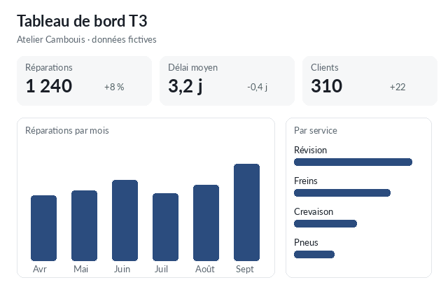

---
pageDecoration:
  icon: bar-chart-2
tags: [rapport]
statut: à relire
resume: "1 240 réparations au T3 (+8 %), délai moyen 3,2 jours, 310 clients. Données fictives."
source: agent:assistant
cree: 2026-10-01
---
# Tableau de bord T3

Version interactive ci-dessous : courbe mensuelle, services et détail. En résumé : **1 240 réparations au T3 (+8 %)**, délai moyen 3,2 jours (-0,4 jour), 310 clients.

> [!NOTE]
> L'artefact s'affiche dans un cadre isolé : il ne voit pas tes notes et ne peut rien envoyer sur Internet.

## À retenir
- Septembre est le meilleur mois du trimestre.
- Les pneus reculent de 18 % : à vérifier. @camille
